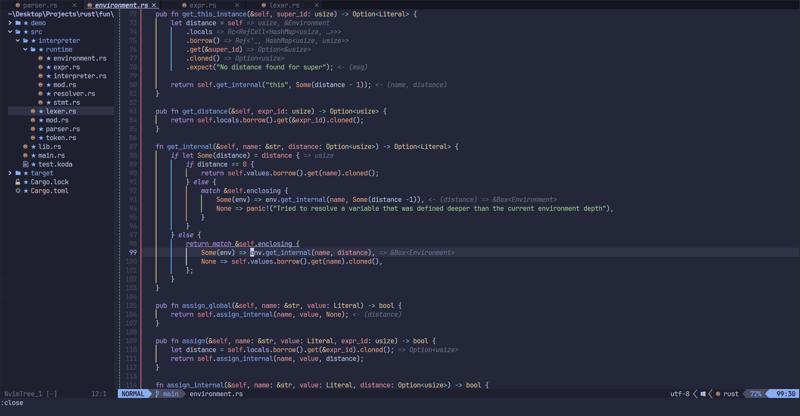
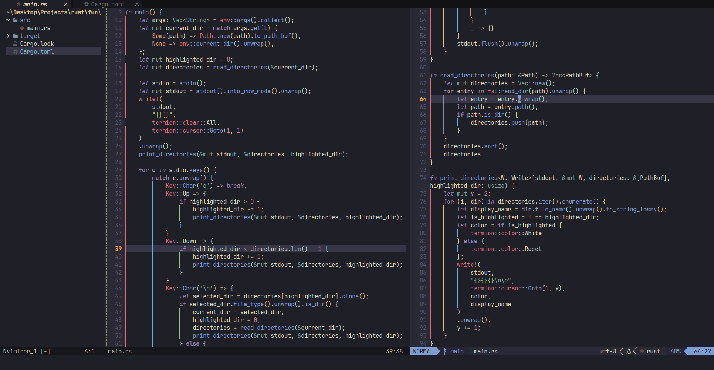
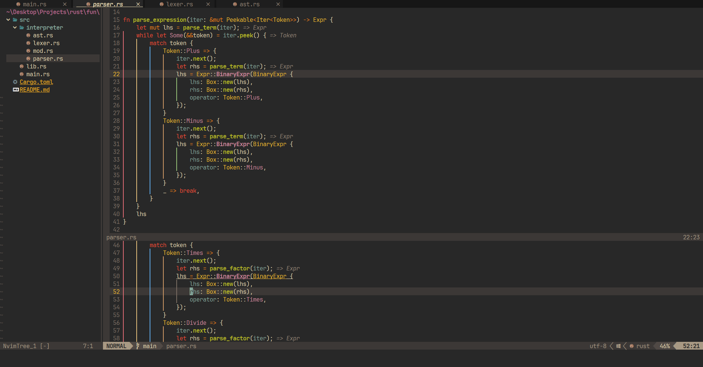

# kawaleo.nvim

This repo contains my current configuration for the `NeoVim` code editor.

## Showcase 🎥

## Features ✨
- Multiple themes which can easily be changed
- Terminal using Toggleterm
- Fuzzy finding with Telescope
- Full-functioning easily customizable LSP, optimized for Rust.
- Status line with Lualine
- Buffer management with Bufferline
- Syntax Highlighting with Treesitter
- Rust designated debugger with rust-tools
- Debug Adapter Protocol with nvim-dap
- Formatting/Linting with Null-ls
- File explorer using nvim-tree
- and more!